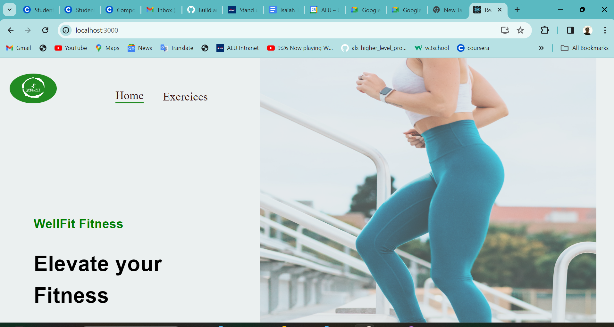

# Wellfit Fitness Application

**Elevating your fitness**

**Author:** Isaiah Essien  
**Date:** January 29th, 2024  
**Institution:** African Leadership University  

## Overview
Wellfit Fitness is a revolutionary fitness application aimed at redefining personal fitness experiences and contributing to users' overall well-being. The app focuses on workouts and exercises, offering a comprehensive solution to address challenges in the fitness landscape and enhance user engagement through innovative features.

## Requirements
- Node.js and npm installed
- React.js
- Material-UI library
- Rapid API key for ExerciseDB
- YouTube API key
- 'ES7+React/Redux/React-Native' extension for VS Code

## Installation
1. Clone the repository
2. cd into Wellfit-FitnessApp/front_stack
3. Run `npm install --legacy-peer-deps` to install all dependencies
4. Run npm start

## Usage
- Run `npm start` to start the development server
- Open [http://localhost:3000](http://localhost:3000) to view the app in your browser

## Screenshots

## System Requirements
- Fetch over 1000 exercises and paginate them
- Load in a few seconds (3-5 seconds)
- Smooth scroll property for easy scrolling on the interface
- Compatible with popular web browsers such as Chrome, Edge, and Firefox

## Deploy Link:
- Go to: https://wellfit-fitness.netlify.app/

## References
- [Urbanisation in Africa poses complex challenges for health systems](https://www.ncbi.nlm.nih.gov/pmc/articles/PMC9516074/#:~:text=Urbanisation%20in%20Africa%20poses%20complex,the%20quadruple%20burden%20of%20disease) - BMJ global health
- [5 wellness trends to watch](https://www.nytimes.com/2023/08/07/well/live/wellness-trends-2023.html) - The New York Times
- [How to address nutrition and its impact on health](https://www.pwc.com/us/en/industries/health-industries/library/addressing-nutritional-impact-on-health.html) - PwC

This project was bootstrapped with [Create React App](https://github.com/facebook/create-react-app).

## Available Scripts

In the project directory, you can run:

### `npm start`

Runs the app in the development mode.\
Open [http://localhost:3000](http://localhost:3000) to view it in your browser.

The page will reload when you make changes.\
You may also see any lint errors in the console.

### `npm test`

Launches the test runner in the interactive watch mode.\
See the section about [running tests](https://facebook.github.io/create-react-app/docs/running-tests) for more information.

### `npm run build`

Builds the app for production to the `build` folder.\
It correctly bundles React in production mode and optimizes the build for the best performance.

The build is minified and the filenames include the hashes.\
Your app is ready to be deployed!

See the section about [deployment](https://facebook.github.io/create-react-app/docs/deployment) for more information.

### `npm run eject`

**Note: this is a one-way operation. Once you `eject`, you can't go back!**

If you aren't satisfied with the build tool and configuration choices, you can `eject` at any time. This command will remove the single build dependency from your project.

Instead, it will copy all the configuration files and the transitive dependencies (webpack, Babel, ESLint, etc) right into your project so you have full control over them. All of the commands except `eject` will still work, but they will point to the copied scripts so you can tweak them. At this point you're on your own.

You don't have to ever use `eject`. The curated feature set is suitable for small and middle deployments, and you shouldn't feel obligated to use this feature. However we understand that this tool wouldn't be useful if you couldn't customize it when you are ready for it.
